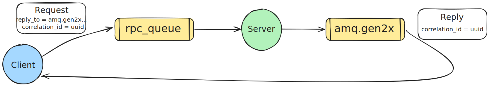

# DCC064-2024.1 - Sistemas Distribuídos - Mensageria (RabbitMQ)

## Remote Procedure Call (RPC)

O exemplo apresentado funciona da seguinte forma:
- Quando o cliente é iniciado, ele cria uma _callback queue_ exclusiva anônima.
- Para uma requisição RPC, o cliente envia uma mensagem com duas propriedades:
`reply_to`, que é definido como a _callback queue_ e `correlation_id`, que é
atribuído um valor único para cada requisição.
- A requisição é enviada para a fila `rpc_queue`.
- O servidor RPC recebe a requisição, faz o processamento e retorna o resultado
  para o cliente usando a fila especifica pela propriedade `reply_to`.
- O cliente espera a resposta na fila de retorno de chamada. Quando uma mensagem
  é recebida, ele verifica a propriedade `correlation_id`. Se o valor é igual ao
  da requisição enviada ele retorna a resposta para a aplicação.

## Rodando o projeto
### Pré-requisitos
- Ter instalado:
  - [Docker](https://docs.docker.com/engine/install/)
  - [Docker Compose](https://docs.docker.com/compose/install/#scenario-two-install-the-compose-plugin)

### Iniciando os containers
Para rodar o projeto basta rodar o seguinte comando na raiz do projeto:
```sh
$ docker compose up -d --build
```
